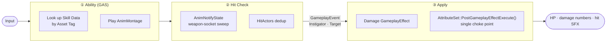

<div align="center">

[한국어](README.md) · **English** · [日本語](README.ja.md) · [中文](README.zh.md)

# Project Wuthering Waves

**Unreal Engine 5.5 · A GAS-based third-person action combat system, rebuilt from scratch**

A personal portfolio project that reconstructs a *Wuthering Waves*–style combat loop — from basic-attack combos to skills and ultimates, team formation with real-time swapping, boss fights (groggy · phases · AI), and hit-feel correction — focused on designing a production-grade action-game combat pipeline in a **data-driven** way.

<br>


<br>


<br><br>

**[▶ Gameplay Video](https://www.youtube.com/watch?v=CJWBYbH8uqA)** &nbsp;·&nbsp;
**[📐 Design Docs (Notion)](https://app.notion.com/p/Wuthering-Waves-3d37222a284580f9b147e7a876d698e3?source=copy_link)** &nbsp;·&nbsp;
**[🗺 Source Code Map](#source-code-map)**

</div>

> The canonical version of this documentation is Korean. This English version is provided for convenience; if anything conflicts, the [Korean README](README.md) is authoritative.

---

## Overview

A project that rebuilds the **combat development pipeline** of a third-person action RPG on top of GAS (Gameplay Ability System). Rather than content volume, the goal is to validate the **scalability and maintainability of the system design**.

- **A design principle that runs through everything** — Damage originates in many places (basic attacks, skills, ultimates, enemy attacks, charge-swaps), but the shared rules (damage calculation, groggy, death, feedback) are handled at a **single choke point** in the `AttributeSet` and nowhere else.
- **Data-driven extension** — Characters, enemies, and skills are separated into `DataAsset` + `GameplayTag`, so adding a new character requires **no changes to the shared C++ code**.
- **Separation of detection and application** — Weapon-trace hit detection in `AnimNotifyState` and damage `GameplayEffect` application are decoupled through a `GameplayEvent`, so a change on one side does not propagate to the other.

| | |
|---|---|
| **Engine / Language** | Unreal Engine 5.5 · C++17 |
| **Core Frameworks** | Gameplay Ability System · Behavior Tree · UMG |
| **Plugins** | Motion Warping · Animation Warping · KawaiiPhysics |
| **Duration / Type** | Jun 2026 – Sep 2026 · Solo project |

---

## Key Features

| System | Summary |
|---|---|
| **Damage Pipeline** | A single terminus every hit passes through — attack-power multipliers · groggy vulnerability (×1.5) · death · feedback all handled in one place |
| **Data-Driven Characters** | `UCharacterDataAsset` + `FSkillData` turn attributes, combat type, and skill loadout into data; tag dispatch lets a single ability be shared by every character |
| **Basic-Attack Combos** | A combo-window + input-buffer state machine for smooth chains |
| **Hit Detection & Correction** | Dual sweep (trace + full weapon) prevents tunneling; a frontal-cone / range-gate fallback corrects near-misses |
| **Soft Lock-On** | Aims and steps in toward the nearest enemy within the camera cone; shares logic with hit correction |
| **Skills · Ultimates · Cooldowns** | Unified skill/ultimate abilities (inheritance), `GE_CoolDown` SetByCaller cooldowns, ultimate gauge |
| **Team Swap** | Three members each with an independent ASC, variation-gauge · edge-triggered UI, charge-swap (reusing the pipeline) |
| **Support Buffs** | An `AttackPower` attribute buffs the whole team's attack power (bench included) |
| **Combat Feedback** | `CombatFeedbackSubsystem` hub — screen-space damage numbers · hit SFX · voice |
| **Enemy Combat AI** | Behavior Tree chase/attack, attack tracking · probabilistic evasion · poise |
| **Boss Fights** | HP-ratio phases, basic-attack-accumulated groggy (stun + vulnerability), spawn intro + battle music |

---

## Architecture

The combat pipeline that every attack passes through. Detection (animation-dependent) and application (data-dependent) are separated by a `GameplayEvent`, and everything finally converges on the `AttributeSet` single choke point.



---

<a name="source-code-map"></a>
## Source Code Map

This repository contains many non-code files — game assets (`Content/`), config, plugins, and so on. The table below jumps **straight to the actual source code and design docs of each core system**.

| System | Core Source | Design Doc |
|---|---|---|
| Damage Pipeline | [`WuWa_AttributeSetBase`](Source/WutheringWaves/Private/GameAbilities/WuWa_AttributeSetBase.cpp) | [design/01](Docs/design/01-damage-pipeline.md) |
| Basic Attack · Combo | [`GA_BaseAttack`](Source/WutheringWaves/Private/GameAbilities/GA_BaseAttack.cpp) | [Docs](Docs/README.md) |
| Hit Detection · Correction | [`WeaponAnimNotifyState`](Source/WutheringWaves/Private/Character/WeaponAnimNotifyState.cpp) | [design/12](Docs/design/12-hit-correction.md) |
| Soft Lock-On | [`PlayableCharacter`](Source/WutheringWaves/Private/Character/PlayableCharacter.cpp) | [design/12](Docs/design/12-hit-correction.md) |
| Resonance Skill · Ultimate | [`GA_ResonanceSkill`](Source/WutheringWaves/Private/GameAbilities/GA_ResonanceSkill.cpp) · [`GA_Liberation`](Source/WutheringWaves/Private/GameAbilities/GA_Liberation.cpp) | [design/02](Docs/design/02-resonance-skill-ultimate.md) |
| Cooldown | [`GE_CoolDown`](Source/WutheringWaves/Private/GameAbilities/GE_CoolDown.cpp) | [design/03](Docs/design/03-cooldown.md) |
| Ultimate Gauge | [`WuWa_AttributeSetBase`](Source/WutheringWaves/Private/GameAbilities/WuWa_AttributeSetBase.cpp) | [design/04](Docs/design/04-ultimate-gauge.md) |
| Team Formation · Swap | [`TeamComponent`](Source/WutheringWaves/Private/Character/TeamComponent.cpp) · [`GA_Intro`](Source/WutheringWaves/Private/GameAbilities/GA_Intro.cpp) | [design/05](Docs/design/05-team-swap.md) |
| Support Buff | [`GA_TeamBuff`](Source/WutheringWaves/Private/GameAbilities/GA_TeamBuff.cpp) · [`GE_AttackBuff`](Source/WutheringWaves/Private/GameAbilities/GE_AttackBuff.cpp) | [design/06](Docs/design/06-support-buff.md) |
| Damage Numbers · Feedback | [`CombatFeedbackSubsystem`](Source/WutheringWaves/Private/Framework/CombatFeedbackSubsystem.cpp) · [`DamageNumberWidget`](Source/WutheringWaves/Private/UI/DamageNumberWidget.cpp) | [design/07](Docs/design/07-damage-numbers.md) · [11](Docs/design/11-combat-feedback.md) |
| Enemy Combat AI | [`EnemyCharacter`](Source/WutheringWaves/Private/Enemy/EnemyCharacter.cpp) · [`BTTask_EnemyAttack`](Source/WutheringWaves/Private/Enemy/BTTask_EnemyAttack.cpp) | [design/10](Docs/design/10-enemy-combat-ai.md) |
| Boss Groggy · Phase · Intro | [`EnemyCharacter`](Source/WutheringWaves/Private/Enemy/EnemyCharacter.cpp) · [`WuwaEnemyController`](Source/WutheringWaves/Private/Enemy/WuwaEnemyController.cpp) | [design/08](Docs/design/08-boss-groggy-phase-ai.md) · [09](Docs/design/09-boss-intro-music.md) |

> Headers live in [`Source/WutheringWaves/Public`](Source/WutheringWaves/Public); implementations in [`Source/WutheringWaves/Private`](Source/WutheringWaves/Private). Design docs (`Docs/`) are written in Korean.

---

## Project Structure

```
wuwa/
├─ Source/WutheringWaves/
│  ├─ Public / Private
│  │  ├─ Character/      BaseCharacter → Playable/Enemy, Team·Equipment components
│  │  ├─ GameAbilities/  GAS abilities (basic·dodge·skill·ultimate·intro·team-buff) + AttributeSet + GE
│  │  ├─ Enemy/          Behavior Tree Task/Service, spawn boxes·triggers, enemy controller
│  │  ├─ Weapon/         Weapon classes / data assets
│  │  ├─ AnimNotify/     Hit-detection · tag-window · target-tracking notifies
│  │  ├─ DataAsset/      Character / enemy data assets
│  │  ├─ Framework/      GameMode · CombatFeedbackSubsystem
│  │  ├─ UI/             HUD · overlay · boss health bar · team portraits · damage numbers
│  │  └─ GameplayTags/   Project gameplay tag definitions
│  └─ WutheringWaves.Build.cs
├─ Content/    Unreal assets (characters · enemies · levels · animations · VO)
├─ Config/     Project / input settings
├─ Plugins/    KawaiiPhysics
└─ Docs/
   ├─ design/  Per-system design docs (01–12)
   ├─ devlog/  Deep dives · refactoring notes
   ├─ drafts/  Portfolio drafts
   └─ media/   Screenshots · GIFs · diagrams
```

---

## Design Documentation

To understand the core combat flow, the following reading order is recommended. The full list is in [`Docs/README.md`](Docs/README.md).

1. [Damage Unification — the AttributeSet single choke point](Docs/design/01-damage-pipeline.md)
2. [Resonance Skill & Ultimate](Docs/design/02-resonance-skill-ultimate.md)
3. [Team Formation & Character Swap](Docs/design/05-team-swap.md)
4. [Boss Fight — Groggy & Phase & AI](Docs/design/08-boss-groggy-phase-ai.md)
5. [Hit Correction (hit feel)](Docs/design/12-hit-correction.md)

---

## Getting Started

1. Install Unreal Engine **5.5**.
2. Right-click `WutheringWaves.uproject` → **Generate Visual Studio project files**.
3. Open `WutheringWaves.sln` and build as **Development Editor / Win64**.
4. In the editor, open a combat level under `Content/WutheringWaves/Level` and play.

> Required plugins (GAS · Motion/Animation Warping) are declared in the `.uproject`, so no extra setup is needed.

---

## Contributors

<table>
  <tr>
    <td align="center">
      <a href="https://github.com/blyuu">
        <br>
        <sub><b>Junsu Kim (blyuu)</b></sub>
      </a><br>
      <sub>Gameplay Programmer</sub>
    </td>
  </tr>
</table>

Solely designed and implemented **every system** — the combat pipeline, character/enemy DataAssets, team swap and boss fights, soft lock-on and hit correction, and more.

---

## Credits & Copyright

This is a **non-commercial project for learning and portfolio purposes**.

**Wuthering Waves** and **all characters, names, visuals, audio, and other assets appearing in it — all copyrights and trademarks belong to Kuro Games (Kuro Game Studio).**
This project is **not affiliated with, endorsed by, or sponsored by Kuro Games.** All characters, names, and related assets are trademarks and © **Kuro Games**. All character rights belong to Kuro Games.

The original work's characters and assets were referenced for learning purposes; the **source code (`Source/`) and design docs (`Docs/`) in this repository were written by the author (Junsu Kim).**

<div align="center">
<sub>© 2026 Junsu Kim (blyuu) · code/docs only &nbsp;|&nbsp; Wuthering Waves © Kuro Games</sub>
</div>
