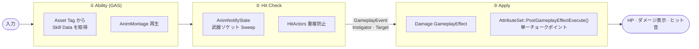

<div align="center">

[한국어](README.md) · [English](README.en.md) · **日本語** · [中文](README.zh.md)

# Project Wuthering Waves

**Unreal Engine 5.5 · GAS ベースの三人称アクション戦闘システムの再構築**

『鳴潮（Wuthering Waves）』スタイルの戦闘ループを — 通常攻撃コンボからスキル・必殺技、チーム編成／リアルタイム交代、ボス戦（グロッキー・フェーズ・AI）、ヒット感補正まで — 商用アクションゲームの戦闘パイプラインを**データ駆動で設計**することに焦点を当てた個人ポートフォリオプロジェクトです。

<br>


<br>


<br><br>

**[▶ プレイ動画](https://www.youtube.com/watch?v=CJWBYbH8uqA)** &nbsp;·&nbsp;
**[📐 設計ドキュメント (Notion)](https://app.notion.com/p/Wuthering-Waves-3d37222a284580f9b147e7a876d698e3?source=copy_link)** &nbsp;·&nbsp;
**[🗺 ソースコードマップ](#source-code-map)**

</div>

> 本ドキュメントの原本は韓国語です。この日本語版は便宜のために提供されており、内容が食い違う場合は [韓国語版 README](README.md) が正となります。

---

## Overview

三人称アクション RPG の**戦闘開発パイプライン**を GAS（Gameplay Ability System）上で再構成したプロジェクトです。コンテンツのボリュームよりも、**システム設計の拡張性と保守性**を検証することを目的としています。

- **全体を貫く設計原則** — 通常攻撃・スキル・必殺技・敵の攻撃・チャージ交代など、ダメージの発生箇所は多いものの、共通ルール（ダメージ計算・グロッキー・死亡・フィードバック）は `AttributeSet` の**単一チョークポイント**でのみ処理します。
- **データ駆動の拡張** — キャラクター・敵・スキルを `DataAsset` + `GameplayTag` に分離し、新規キャラクター追加時に**共通の C++ コードを変更しません**。
- **判定と適用の分離** — `AnimNotifyState` の武器軌跡による判定と、ダメージ `GameplayEffect` の適用を `GameplayEvent` で切り離し、一方の変更がもう一方へ波及しないようにしています。

| | |
|---|---|
| **エンジン / 言語** | Unreal Engine 5.5 · C++17 |
| **コアフレームワーク** | Gameplay Ability System · Behavior Tree · UMG |
| **プラグイン** | Motion Warping · Animation Warping · KawaiiPhysics |
| **開発期間 / 形態** | 2026.06 ～ 2026.09 · 個人プロジェクト |

---

## Key Features

| システム | 概要 |
|---|---|
| **ダメージパイプライン** | すべてのダメージが通過する単一の終着点 — 攻撃力倍率・グロッキー時の被弾増加（×1.5）・死亡・フィードバックを一箇所で処理 |
| **データ駆動キャラクター** | `UCharacterDataAsset` + `FSkillData` で属性・戦闘タイプ・スキル構成をデータ化し、タグディスパッチで 1 つのアビリティを全キャラクターが共有 |
| **通常攻撃コンボ** | コンボウィンドウ + 先行入力バッファのステートマシンによる自然な連続技 |
| **ヒット判定 & 補正** | 二重スイープ（軌跡 + 武器全体）でトンネリングを防止し、空振り時は正面コーン・射程ゲートのフォールバック補正 |
| **ソフトロックオン** | カメラコーン内の最近接の敵へ照準・ステップイン。ヒット補正とロジックを共有 |
| **スキル · 必殺技 · クールタイム** | スキル／必殺技アビリティの統合（継承）、`GE_CoolDown` の SetByCaller クールタイム、必殺技ゲージ |
| **チーム交代** | 3 人が独立した ASC を持つ編成、変奏ゲージ・エッジトリガー UI、チャージ交代（パイプライン再利用） |
| **サポーターバフ** | `AttackPower` アトリビュートでチーム全体（ベンチ含む）の攻撃力をバフ |
| **戦闘フィードバック** | `CombatFeedbackSubsystem` ハブ — スクリーンスペースのダメージ表示 · ヒット音 · ボイス |
| **敵戦闘 AI** | Behavior Tree による追跡／攻撃、攻撃トラッキング · 確率回避 · ポイズ |
| **ボス戦** | HP 比率によるフェーズ、通常攻撃の蓄積によるグロッキー（スタン + 被弾増加）、登場演出 + バトル BGM |

---

## Architecture

すべての攻撃が共通して通過する戦闘パイプライン。判定（アニメーション依存）と適用（データ依存）を `GameplayEvent` で分離し、最後に `AttributeSet` の単一チョークポイントへ収束させます。



---

<a name="source-code-map"></a>
## Source Code Map

本リポジトリにはゲームアセット（`Content/`）・設定・プラグインなど、コード以外のファイルが多く含まれます。以下の表から、**主要システムの実際のソースコードと設計ドキュメントへ直接移動**できます。

| システム | 主要ソース | 設計ドキュメント |
|---|---|---|
| ダメージパイプライン | [`WuWa_AttributeSetBase`](Source/WutheringWaves/Private/GameAbilities/WuWa_AttributeSetBase.cpp) | [design/01](Docs/design/01-damage-pipeline.md) |
| 通常攻撃 · コンボ | [`GA_BaseAttack`](Source/WutheringWaves/Private/GameAbilities/GA_BaseAttack.cpp) | [Docs](Docs/README.md) |
| ヒット判定 · 補正 | [`WeaponAnimNotifyState`](Source/WutheringWaves/Private/Character/WeaponAnimNotifyState.cpp) | [design/12](Docs/design/12-hit-correction.md) |
| ソフトロックオン | [`PlayableCharacter`](Source/WutheringWaves/Private/Character/PlayableCharacter.cpp) | [design/12](Docs/design/12-hit-correction.md) |
| レゾナンススキル · 必殺技 | [`GA_ResonanceSkill`](Source/WutheringWaves/Private/GameAbilities/GA_ResonanceSkill.cpp) · [`GA_Liberation`](Source/WutheringWaves/Private/GameAbilities/GA_Liberation.cpp) | [design/02](Docs/design/02-resonance-skill-ultimate.md) |
| クールタイム | [`GE_CoolDown`](Source/WutheringWaves/Private/GameAbilities/GE_CoolDown.cpp) | [design/03](Docs/design/03-cooldown.md) |
| 必殺技ゲージ | [`WuWa_AttributeSetBase`](Source/WutheringWaves/Private/GameAbilities/WuWa_AttributeSetBase.cpp) | [design/04](Docs/design/04-ultimate-gauge.md) |
| チーム編成 · 交代 | [`TeamComponent`](Source/WutheringWaves/Private/Character/TeamComponent.cpp) · [`GA_Intro`](Source/WutheringWaves/Private/GameAbilities/GA_Intro.cpp) | [design/05](Docs/design/05-team-swap.md) |
| サポーターバフ | [`GA_TeamBuff`](Source/WutheringWaves/Private/GameAbilities/GA_TeamBuff.cpp) · [`GE_AttackBuff`](Source/WutheringWaves/Private/GameAbilities/GE_AttackBuff.cpp) | [design/06](Docs/design/06-support-buff.md) |
| ダメージ表示 · フィードバック | [`CombatFeedbackSubsystem`](Source/WutheringWaves/Private/Framework/CombatFeedbackSubsystem.cpp) · [`DamageNumberWidget`](Source/WutheringWaves/Private/UI/DamageNumberWidget.cpp) | [design/07](Docs/design/07-damage-numbers.md) · [11](Docs/design/11-combat-feedback.md) |
| 敵戦闘 AI | [`EnemyCharacter`](Source/WutheringWaves/Private/Enemy/EnemyCharacter.cpp) · [`BTTask_EnemyAttack`](Source/WutheringWaves/Private/Enemy/BTTask_EnemyAttack.cpp) | [design/10](Docs/design/10-enemy-combat-ai.md) |
| ボスのグロッキー · フェーズ · 登場 | [`EnemyCharacter`](Source/WutheringWaves/Private/Enemy/EnemyCharacter.cpp) · [`WuwaEnemyController`](Source/WutheringWaves/Private/Enemy/WuwaEnemyController.cpp) | [design/08](Docs/design/08-boss-groggy-phase-ai.md) · [09](Docs/design/09-boss-intro-music.md) |

> すべてのヘッダーは [`Source/WutheringWaves/Public`](Source/WutheringWaves/Public)、実装は [`Source/WutheringWaves/Private`](Source/WutheringWaves/Private) にあります。設計ドキュメント（`Docs/`）は韓国語で記述されています。

---

## Project Structure

```
wuwa/
├─ Source/WutheringWaves/
│  ├─ Public / Private
│  │  ├─ Character/      BaseCharacter → Playable/Enemy、Team・Equipment コンポーネント
│  │  ├─ GameAbilities/  GAS アビリティ（通常攻撃・回避・スキル・必殺技・イントロ・チームバフ）+ AttributeSet + GE
│  │  ├─ Enemy/          Behavior Tree の Task/Service、スポーンボックス・トリガー、敵コントローラー
│  │  ├─ Weapon/         武器クラス / データアセット
│  │  ├─ AnimNotify/     ヒット判定 · タグウィンドウ · ターゲット追跡の Notify
│  │  ├─ DataAsset/      キャラクター / 敵のデータアセット
│  │  ├─ Framework/      GameMode · CombatFeedbackSubsystem
│  │  ├─ UI/             HUD · オーバーレイ · ボス体力バー · チームポートレート · ダメージ表示
│  │  └─ GameplayTags/   プロジェクトの GameplayTag 定義
│  └─ WutheringWaves.Build.cs
├─ Content/    Unreal アセット（キャラクター · 敵 · レベル · アニメーション · VO）
├─ Config/     プロジェクト / 入力設定
├─ Plugins/    KawaiiPhysics
└─ Docs/
   ├─ design/  各システムの設計ドキュメント（01～12）
   ├─ devlog/  ディープダイブ · リファクタリング記録
   ├─ drafts/  ポートフォリオ草稿
   └─ media/   スクリーンショット · GIF · ダイアグラム
```

---

## Design Documentation

戦闘の中核的な流れを理解するには、以下の順序を推奨します。全リストは [`Docs/README.md`](Docs/README.md) にあります。

1. [ダメージの一元化 — AttributeSet の単一チョークポイント](Docs/design/01-damage-pipeline.md)
2. [レゾナンススキル & 必殺技](Docs/design/02-resonance-skill-ultimate.md)
3. [チーム編成 & キャラクター交代](Docs/design/05-team-swap.md)
4. [ボス戦 — グロッキー & フェーズ & AI](Docs/design/08-boss-groggy-phase-ai.md)
5. [ヒット補正（ヒット感）](Docs/design/12-hit-correction.md)

---

## Getting Started

1. Unreal Engine **5.5** をインストールします。
2. `WutheringWaves.uproject` を右クリック → **Generate Visual Studio project files**。
3. `WutheringWaves.sln` を開き、**Development Editor / Win64** でビルドします。
4. エディタで `Content/WutheringWaves/Level` の戦闘レベルを開いてプレイします。

> 必須プラグイン（GAS · Motion/Animation Warping）は `.uproject` に明記されているため、別途の設定は不要です。

---

## Contributors

<table>
  <tr>
    <td align="center">
      <a href="https://github.com/blyuu">
        <br>
        <sub><b>김준수 (blyuu)</b></sub>
      </a><br>
      <sub>ゲームプレイプログラマー</sub>
    </td>
  </tr>
</table>

戦闘パイプラインの設計・構築、キャラクター・敵の DataAsset、チーム交代・ボス戦、ソフトロックオン・ヒット補正など、**全システムを単独で設計・実装**しました。

---

## Credits & Copyright

本プロジェクトは、**学習およびポートフォリオを目的とした非商用プロジェクト**です。

**『鳴潮（Wuthering Waves）』** および作中に登場する **すべてのキャラクター・名称・ビジュアル・オーディオ等、あらゆる著作権・商標権は Kuro Games（Kuro Game Studio）に帰属します。**
This project is **not affiliated with, endorsed by, or sponsored by Kuro Games.** All characters, names, and related assets are trademarks and © **Kuro Games**. All character rights belong to Kuro Games.

原作のキャラクター・アセットを学習目的で参照しており、本リポジトリの **ソースコード（`Source/`）と設計ドキュメント（`Docs/`）は作者本人（김준수）が作成**したものです。

<div align="center">
<sub>© 2026 김준수 (blyuu) · コード/ドキュメントに限る &nbsp;|&nbsp; Wuthering Waves © Kuro Games</sub>
</div>
