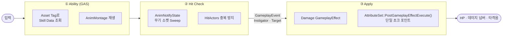

<div align="center">

# Project Wuthering Waves

**언리얼 엔진 5.5 · GAS 기반 3인칭 액션 전투 시스템 재구현**

명조(Wuthering Waves) 스타일의 전투 루프를 — 평타 콤보부터 스킬·궁극기, 팀 편성/실시간 교체, 보스전(그로기·페이즈·AI), 타격감 보정까지 — **상용 액션 게임의 전투 파이프라인을 데이터 주도로 설계**하는 데 초점을 맞춘 개인 포트폴리오 프로젝트입니다.

<br>


<br>


<br><br>

**[▶ 플레이 영상](https://www.youtube.com/watch?v=CJWBYbH8uqA)** &nbsp;·&nbsp;
**[📐 설계 문서 (Notion)](https://app.notion.com/p/Wuthering-Waves-3d37222a284580f9b147e7a876d698e3?source=copy_link)** &nbsp;·&nbsp;
**[🗺 소스 코드 맵](#source-code-map)**

</div>

---

## Overview

3인칭 액션 RPG의 **전투 개발 파이프라인**을 GAS(Gameplay Ability System) 위에서 재구성한 프로젝트입니다. 콘텐츠 볼륨보다 **시스템 설계의 확장성과 유지보수성**을 검증하는 데 목적을 두었습니다.

- **관통하는 설계 원칙** — 평타·스킬·궁극기·적 공격·충전 교체 등 데미지 발생 지점은 많지만, 공통 규칙(피해 계산·그로기·사망·피드백)은 `AttributeSet` **단일 초크 포인트**에서만 처리합니다.
- **데이터 주도 확장** — 캐릭터·적·스킬을 `DataAsset` + `GameplayTag`로 분리해, 신규 캐릭터 추가 시 **공통 C++ 코드를 수정하지 않습니다.**
- **판정과 적용의 분리** — `AnimNotifyState`의 무기 궤적 판정과 데미지 `GameplayEffect` 적용을 `GameplayEvent`로 끊어, 한쪽 변경이 다른 쪽에 전파되지 않습니다.

| | |
|---|---|
| **엔진 / 언어** | Unreal Engine 5.5 · C++17 |
| **핵심 프레임워크** | Gameplay Ability System · Behavior Tree · UMG |
| **플러그인** | Motion Warping · Animation Warping · KawaiiPhysics |
| **개발 기간 / 형태** | 2026.06 ~ 2026.09 · 개인 프로젝트 |

---

## Screenshots

| | |
|:---:|:---:|
|  |  |
|  |  |

> GIF 데모(콤보 · 팀 교체 · 보스 그로기 등)는 추가 예정입니다.

---

## Key Features

| 시스템 | 요약 |
|---|---|
| **데미지 파이프라인** | 모든 데미지가 통과하는 단일 종착점 — 공격력 배수 · 그로기 취약(×1.5) · 사망 · 피드백을 한 곳에서 처리 |
| **데이터 주도 캐릭터** | `UCharacterDataAsset` + `FSkillData`로 속성·전투 타입·스킬 구성을 데이터화, 태그 디스패치로 어빌리티 하나를 전 캐릭터가 공유 |
| **평타 콤보** | 콤보 윈도우 + 선입력 버퍼 상태 머신으로 자연스러운 연속기 |
| **히트 판정 & 보정** | 이중 스윕(궤적 + 무기 전체)으로 터널링 방지, 빗맞을 때 정면 원뿔·사거리 게이트 폴백 보정 |
| **소프트 락온** | 카메라 원뿔 내 최근접 적으로 조준·step-in, 히트 보정과 로직 공유 |
| **스킬 · 궁극기 · 쿨타임** | 스킬/궁극기 어빌리티 통합(상속), `GE_CoolDown` SetByCaller 쿨타임, 궁극기 게이지 |
| **팀 교체** | 3인 독립 ASC 편성, 변주 게이지 · 엣지 트리거 UI, 충전 교체(파이프라인 재사용) |
| **서포터 버프** | `AttackPower` 어트리뷰트로 팀 전체(벤치 포함) 공격력 버프 |
| **전투 피드백** | `CombatFeedbackSubsystem` 허브 — 스크린 스페이스 데미지 넘버 · 타격음 · 보이스 |
| **적 전투 AI** | Behavior Tree 추격/공격, 공격 추적 · 확률 회피 · 포이즈 |
| **보스전** | HP 비율 페이즈, 평타 누적 그로기(스턴 + 취약), 등장 연출 + 배틀 음악 |

---

## Architecture

모든 공격이 공통으로 통과하는 전투 파이프라인. 판정(애니메이션 종속)과 적용(데이터 종속)을 `GameplayEvent`로 분리하고, 마지막에 `AttributeSet` 단일 초크 포인트로 수렴합니다.



---

<a name="source-code-map"></a>
## Source Code Map

이 저장소는 게임 애셋(`Content/`)·설정·플러그인 등 코드 외 파일이 많습니다. 아래 표에서 **핵심 시스템의 실제 소스 코드와 설계 문서로 바로 이동**할 수 있습니다.

| 시스템 | 핵심 소스 | 설계 문서 |
|---|---|---|
| 데미지 파이프라인 | [`WuWa_AttributeSetBase`](Source/WutheringWaves/Private/GameAbilities/WuWa_AttributeSetBase.cpp) | [design/01](Docs/design/01-damage-pipeline.md) |
| 평타 · 콤보 | [`GA_BaseAttack`](Source/WutheringWaves/Private/GameAbilities/GA_BaseAttack.cpp) | [Docs](Docs/README.md) |
| 히트 판정 · 보정 | [`WeaponAnimNotifyState`](Source/WutheringWaves/Private/Character/WeaponAnimNotifyState.cpp) | [design/12](Docs/design/12-hit-correction.md) |
| 소프트 락온 | [`PlayableCharacter`](Source/WutheringWaves/Private/Character/PlayableCharacter.cpp) | [design/12](Docs/design/12-hit-correction.md) |
| 레조넌스 스킬 · 궁극기 | [`GA_ResonanceSkill`](Source/WutheringWaves/Private/GameAbilities/GA_ResonanceSkill.cpp) · [`GA_Liberation`](Source/WutheringWaves/Private/GameAbilities/GA_Liberation.cpp) | [design/02](Docs/design/02-resonance-skill-ultimate.md) |
| 쿨타임 | [`GE_CoolDown`](Source/WutheringWaves/Private/GameAbilities/GE_CoolDown.cpp) | [design/03](Docs/design/03-cooldown.md) |
| 궁극기 게이지 | [`WuWa_AttributeSetBase`](Source/WutheringWaves/Private/GameAbilities/WuWa_AttributeSetBase.cpp) | [design/04](Docs/design/04-ultimate-gauge.md) |
| 팀 편성 · 교체 | [`TeamComponent`](Source/WutheringWaves/Private/Character/TeamComponent.cpp) · [`GA_Intro`](Source/WutheringWaves/Private/GameAbilities/GA_Intro.cpp) | [design/05](Docs/design/05-team-swap.md) |
| 서포터 버프 | [`GA_TeamBuff`](Source/WutheringWaves/Private/GameAbilities/GA_TeamBuff.cpp) · [`GE_AttackBuff`](Source/WutheringWaves/Private/GameAbilities/GE_AttackBuff.cpp) | [design/06](Docs/design/06-support-buff.md) |
| 데미지 넘버 · 피드백 | [`CombatFeedbackSubsystem`](Source/WutheringWaves/Private/Framework/CombatFeedbackSubsystem.cpp) · [`DamageNumberWidget`](Source/WutheringWaves/Private/UI/DamageNumberWidget.cpp) | [design/07](Docs/design/07-damage-numbers.md) · [11](Docs/design/11-combat-feedback.md) |
| 적 전투 AI | [`EnemyCharacter`](Source/WutheringWaves/Private/Enemy/EnemyCharacter.cpp) · [`BTTask_EnemyAttack`](Source/WutheringWaves/Private/Enemy/BTTask_EnemyAttack.cpp) | [design/10](Docs/design/10-enemy-combat-ai.md) |
| 보스 그로기 · 페이즈 · 등장 | [`EnemyCharacter`](Source/WutheringWaves/Private/Enemy/EnemyCharacter.cpp) · [`WuwaEnemyController`](Source/WutheringWaves/Private/Enemy/WuwaEnemyController.cpp) | [design/08](Docs/design/08-boss-groggy-phase-ai.md) · [09](Docs/design/09-boss-intro-music.md) |

> 전체 헤더는 [`Source/WutheringWaves/Public`](Source/WutheringWaves/Public), 구현은 [`Source/WutheringWaves/Private`](Source/WutheringWaves/Private)에 있습니다.

---

## Project Structure

```
wuwa/
├─ Source/WutheringWaves/
│  ├─ Public / Private
│  │  ├─ Character/      BaseCharacter → Playable/Enemy, Team·Equipment 컴포넌트
│  │  ├─ GameAbilities/  GAS 어빌리티(평타·회피·스킬·궁극·인트로·팀버프) + AttributeSet + GE
│  │  ├─ Enemy/          Behavior Tree Task/Service, 스폰 박스·트리거, 적 컨트롤러
│  │  ├─ Weapon/         무기 클래스 / 데이터 애셋
│  │  ├─ AnimNotify/     히트 판정 · 태그 윈도우 · 타깃 추적 노티파이
│  │  ├─ DataAsset/      캐릭터 / 적 데이터 애셋
│  │  ├─ Framework/      GameMode · CombatFeedbackSubsystem
│  │  ├─ UI/             HUD · 오버레이 · 보스 체력바 · 팀 초상화 · 데미지 넘버
│  │  └─ GameplayTags/   프로젝트 게임플레이 태그 정의
│  └─ WutheringWaves.Build.cs
├─ Content/    언리얼 애셋 (캐릭터 · 적 · 레벨 · 애니메이션 · VO)
├─ Config/     프로젝트 / 입력 설정
├─ Plugins/    KawaiiPhysics
└─ Docs/
   ├─ design/  시스템별 설계 문서 (01~12)
   ├─ devlog/  딥다이브 · 리팩터링 기록
   ├─ drafts/  포트폴리오 초안
   └─ media/   스크린샷 · GIF · 다이어그램
```

---

## Design Documentation

전투의 핵심 흐름을 이해하려면 아래 순서를 추천합니다. 전체 목록은 [`Docs/README.md`](Docs/README.md)에 있습니다.

1. [데미지 일원화 — AttributeSet 단일 초크 포인트](Docs/design/01-damage-pipeline.md)
2. [레조넌스 스킬 & 궁극기](Docs/design/02-resonance-skill-ultimate.md)
3. [팀 편성 & 캐릭터 교체](Docs/design/05-team-swap.md)
4. [보스전 — 그로기 & 페이즈 & AI](Docs/design/08-boss-groggy-phase-ai.md)
5. [히트 보정 (타격감)](Docs/design/12-hit-correction.md)

---

## Getting Started

1. Unreal Engine **5.5**를 설치합니다.
2. `WutheringWaves.uproject`를 우클릭 → **Generate Visual Studio project files**.
3. `WutheringWaves.sln`을 열어 **Development Editor / Win64**로 빌드합니다.
4. 에디터에서 `Content/WutheringWaves/Level`의 전투 레벨을 열어 플레이합니다.

> 필수 플러그인(GAS · Motion/Animation Warping)은 `.uproject`에 명시되어 있어 별도 설정이 필요 없습니다.

---

## Contributors

<table>
  <tr>
    <td align="center">
      <a href="https://github.com/blyuu">
        <br>
        <sub><b>김준수 (blyuu)</b></sub>
      </a><br>
      <sub>Gameplay Programmer</sub>
    </td>
  </tr>
</table>

전투 파이프라인 설계·구축, 캐릭터·적 DataAsset, 팀 교체·보스전, 소프트 락온·히트 보정 등 **전 시스템을 단독으로 설계·구현**했습니다.

---

## Credits & Copyright

이 프로젝트는 **학습 및 포트폴리오 목적의 비상업적 프로젝트**입니다.

**Wuthering Waves(명조: 워더링 웨이브)** 및 이에 등장하는 **모든 캐릭터·명칭·비주얼·오디오 등 모든 저작권과 상표권은 Kuro Games(Kuro Game Studio)에 있습니다.**
This project is **not affiliated with, endorsed by, or sponsored by Kuro Games.** All characters, names, and related assets are trademarks and © **Kuro Games**. All character rights belong to Kuro Games.

원저작물의 캐릭터·애셋을 학습 목적으로 참조하였으며, 본 저장소의 **소스 코드(`Source/`)와 설계 문서(`Docs/`)는 작성자 본인(김준수)이 작성**한 것입니다.

<div align="center">
<sub>© 2026 김준수 (blyuu) · 코드/문서에 한함 &nbsp;|&nbsp; Wuthering Waves © Kuro Games</sub>
</div>
