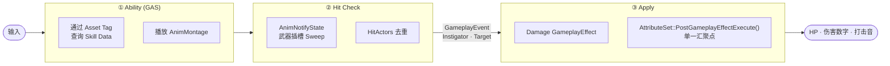

<div align="center">

[한국어](README.md) · [English](README.en.md) · [日本語](README.ja.md) · **中文**

# Project Wuthering Waves

**Unreal Engine 5.5 · 基于 GAS 的第三人称动作战斗系统重构**

一个个人作品集项目，聚焦于以**数据驱动**的方式设计商业级动作游戏的战斗管线 —— 将《鸣潮（Wuthering Waves）》风格的战斗循环，从普攻连段到技能·终结技、队伍编成／实时换人、Boss 战（失衡·阶段·AI）、打击感补正，进行完整重构。

<br>


<br>


<br><br>

**[▶ 游玩视频](https://www.youtube.com/watch?v=CJWBYbH8uqA)** &nbsp;·&nbsp;
**[📐 设计文档 (Notion)](https://app.notion.com/p/Wuthering-Waves-3d37222a284580f9b147e7a876d698e3?source=copy_link)** &nbsp;·&nbsp;
**[🗺 源码地图](#source-code-map)**

</div>

> 本文档的原文为韩语。此中文版本仅为方便阅读而提供；如有出入，以 [韩语版 README](README.md) 为准。

---

## Overview

本项目在 GAS（Gameplay Ability System）之上重构了第三人称动作 RPG 的**战斗开发管线**。相比内容体量，其目标在于验证**系统设计的可扩展性与可维护性**。

- **贯穿始终的设计原则** —— 普攻·技能·终结技·敌人攻击·充能换人等，伤害的产生入口很多，但共通规则（伤害计算·失衡·死亡·反馈）只在 `AttributeSet` 这一**单一汇聚点**处理。
- **数据驱动的扩展** —— 将角色·敌人·技能拆分为 `DataAsset` + `GameplayTag`，新增角色时**无需修改共通的 C++ 代码**。
- **判定与应用的分离** —— 将 `AnimNotifyState` 的武器轨迹判定与伤害 `GameplayEffect` 的应用通过 `GameplayEvent` 解耦，一侧的改动不会波及另一侧。

| | |
|---|---|
| **引擎 / 语言** | Unreal Engine 5.5 · C++17 |
| **核心框架** | Gameplay Ability System · Behavior Tree · UMG |
| **插件** | Motion Warping · Animation Warping · KawaiiPhysics |
| **开发周期 / 形式** | 2026.06 ~ 2026.09 · 个人项目 |

---

## Key Features

| 系统 | 概要 |
|---|---|
| **伤害管线** | 所有伤害都会经过的单一终点 —— 攻击力倍率·失衡易伤（×1.5）·死亡·反馈都在一处处理 |
| **数据驱动角色** | 用 `UCharacterDataAsset` + `FSkillData` 将属性·战斗类型·技能构成数据化，通过标签分发让一个 Ability 被全体角色共享 |
| **普攻连段** | 由连段窗口 + 预输入缓冲的状态机实现流畅的连续技 |
| **命中判定 & 补正** | 双重扫掠（轨迹 + 武器整体）防止穿透；未命中时以正面锥形·射程门限进行回退补正 |
| **软锁定** | 瞄准并突进至相机锥形内最近的敌人，与命中补正共享逻辑 |
| **技能 · 终结技 · 冷却** | 统一的技能／终结技 Ability（继承），`GE_CoolDown` SetByCaller 冷却，终结技能量条 |
| **队伍换人** | 三名成员各自拥有独立的 ASC 编成，变奏能量条·边沿触发 UI，充能换人（复用管线） |
| **辅助增益** | 通过 `AttackPower` 属性为全队（含替补）提供攻击力增益 |
| **战斗反馈** | `CombatFeedbackSubsystem` 中枢 —— 屏幕空间伤害数字 · 打击音 · 语音 |
| **敌人战斗 AI** | Behavior Tree 追击/攻击，攻击追踪 · 概率闪避 · 韧性 |
| **Boss 战** | 按 HP 比例的阶段、普攻累积导致的失衡（眩晕 + 易伤）、登场演出 + 战斗音乐 |

---

## Architecture

所有攻击共同经过的战斗管线。将判定（依赖动画）与应用（依赖数据）通过 `GameplayEvent` 分离，最终汇聚到 `AttributeSet` 这一单一汇聚点。



---

<a name="source-code-map"></a>
## Source Code Map

本仓库包含大量非代码文件，如游戏资源（`Content/`）·配置·插件等。可通过下表**直接跳转到核心系统的实际源码与设计文档**。

| 系统 | 核心源码 | 设计文档 |
|---|---|---|
| 伤害管线 | [`WuWa_AttributeSetBase`](Source/WutheringWaves/Private/GameAbilities/WuWa_AttributeSetBase.cpp) | [design/01](Docs/design/01-damage-pipeline.md) |
| 普攻 · 连段 | [`GA_BaseAttack`](Source/WutheringWaves/Private/GameAbilities/GA_BaseAttack.cpp) | [Docs](Docs/README.md) |
| 命中判定 · 补正 | [`WeaponAnimNotifyState`](Source/WutheringWaves/Private/Character/WeaponAnimNotifyState.cpp) | [design/12](Docs/design/12-hit-correction.md) |
| 软锁定 | [`PlayableCharacter`](Source/WutheringWaves/Private/Character/PlayableCharacter.cpp) | [design/12](Docs/design/12-hit-correction.md) |
| 共鸣技能 · 终结技 | [`GA_ResonanceSkill`](Source/WutheringWaves/Private/GameAbilities/GA_ResonanceSkill.cpp) · [`GA_Liberation`](Source/WutheringWaves/Private/GameAbilities/GA_Liberation.cpp) | [design/02](Docs/design/02-resonance-skill-ultimate.md) |
| 冷却 | [`GE_CoolDown`](Source/WutheringWaves/Private/GameAbilities/GE_CoolDown.cpp) | [design/03](Docs/design/03-cooldown.md) |
| 终结技能量条 | [`WuWa_AttributeSetBase`](Source/WutheringWaves/Private/GameAbilities/WuWa_AttributeSetBase.cpp) | [design/04](Docs/design/04-ultimate-gauge.md) |
| 队伍编成 · 换人 | [`TeamComponent`](Source/WutheringWaves/Private/Character/TeamComponent.cpp) · [`GA_Intro`](Source/WutheringWaves/Private/GameAbilities/GA_Intro.cpp) | [design/05](Docs/design/05-team-swap.md) |
| 辅助增益 | [`GA_TeamBuff`](Source/WutheringWaves/Private/GameAbilities/GA_TeamBuff.cpp) · [`GE_AttackBuff`](Source/WutheringWaves/Private/GameAbilities/GE_AttackBuff.cpp) | [design/06](Docs/design/06-support-buff.md) |
| 伤害数字 · 反馈 | [`CombatFeedbackSubsystem`](Source/WutheringWaves/Private/Framework/CombatFeedbackSubsystem.cpp) · [`DamageNumberWidget`](Source/WutheringWaves/Private/UI/DamageNumberWidget.cpp) | [design/07](Docs/design/07-damage-numbers.md) · [11](Docs/design/11-combat-feedback.md) |
| 敌人战斗 AI | [`EnemyCharacter`](Source/WutheringWaves/Private/Enemy/EnemyCharacter.cpp) · [`BTTask_EnemyAttack`](Source/WutheringWaves/Private/Enemy/BTTask_EnemyAttack.cpp) | [design/10](Docs/design/10-enemy-combat-ai.md) |
| Boss 失衡 · 阶段 · 登场 | [`EnemyCharacter`](Source/WutheringWaves/Private/Enemy/EnemyCharacter.cpp) · [`WuwaEnemyController`](Source/WutheringWaves/Private/Enemy/WuwaEnemyController.cpp) | [design/08](Docs/design/08-boss-groggy-phase-ai.md) · [09](Docs/design/09-boss-intro-music.md) |

> 所有头文件位于 [`Source/WutheringWaves/Public`](Source/WutheringWaves/Public)，实现位于 [`Source/WutheringWaves/Private`](Source/WutheringWaves/Private)。设计文档（`Docs/`）以韩语撰写。

---

## Project Structure

```
wuwa/
├─ Source/WutheringWaves/
│  ├─ Public / Private
│  │  ├─ Character/      BaseCharacter → Playable/Enemy，Team·Equipment 组件
│  │  ├─ GameAbilities/  GAS Ability（普攻·闪避·技能·终结技·登场·队伍增益）+ AttributeSet + GE
│  │  ├─ Enemy/          Behavior Tree Task/Service，生成盒·触发器，敌人控制器
│  │  ├─ Weapon/         武器类 / 数据资源
│  │  ├─ AnimNotify/     命中判定 · 标签窗口 · 目标追踪 Notify
│  │  ├─ DataAsset/      角色 / 敌人数据资源
│  │  ├─ Framework/      GameMode · CombatFeedbackSubsystem
│  │  ├─ UI/             HUD · 覆盖层 · Boss 血条 · 队伍头像 · 伤害数字
│  │  └─ GameplayTags/   项目 GameplayTag 定义
│  └─ WutheringWaves.Build.cs
├─ Content/    Unreal 资源（角色 · 敌人 · 关卡 · 动画 · VO）
├─ Config/     项目 / 输入设置
├─ Plugins/    KawaiiPhysics
└─ Docs/
   ├─ design/  各系统设计文档（01～12）
   ├─ devlog/  深入解析 · 重构记录
   ├─ drafts/  作品集草稿
   └─ media/   截图 · GIF · 示意图
```

---

## Design Documentation

若想理解战斗的核心流程，推荐按以下顺序阅读。完整列表见 [`Docs/README.md`](Docs/README.md)。

1. [伤害一元化 — AttributeSet 单一汇聚点](Docs/design/01-damage-pipeline.md)
2. [共鸣技能 & 终结技](Docs/design/02-resonance-skill-ultimate.md)
3. [队伍编成 & 角色换人](Docs/design/05-team-swap.md)
4. [Boss 战 — 失衡 & 阶段 & AI](Docs/design/08-boss-groggy-phase-ai.md)
5. [打击感补正](Docs/design/12-hit-correction.md)

---

## Getting Started

1. 安装 Unreal Engine **5.5**。
2. 右键点击 `WutheringWaves.uproject` → **Generate Visual Studio project files**。
3. 打开 `WutheringWaves.sln`，以 **Development Editor / Win64** 构建。
4. 在编辑器中打开 `Content/WutheringWaves/Level` 下的战斗关卡进行游玩。

> 必需插件（GAS · Motion/Animation Warping）已在 `.uproject` 中声明，无需额外设置。

---

## Contributors

<table>
  <tr>
    <td align="center">
      <a href="https://github.com/blyuu">
        <br>
        <sub><b>김준수 (blyuu)</b></sub>
      </a><br>
      <sub>游戏程序（Gameplay Programmer）</sub>
    </td>
  </tr>
</table>

**独立设计并实现了全部系统** —— 战斗管线的设计与搭建、角色·敌人 DataAsset、队伍换人·Boss 战、软锁定·命中补正等。

---

## Credits & Copyright

本项目是以**学习和作品集为目的的非商业项目**。

**《鸣潮（Wuthering Waves）》** 及其中出现的 **所有角色·名称·视觉·音频等一切内容的著作权与商标权，均归 Kuro Games（Kuro Game Studio）所有。**
This project is **not affiliated with, endorsed by, or sponsored by Kuro Games.** All characters, names, and related assets are trademarks and © **Kuro Games**. All character rights belong to Kuro Games.

出于学习目的参考了原作的角色·资源，本仓库的 **源码（`Source/`）与设计文档（`Docs/`）由作者本人（김준수）编写。**

<div align="center">
<sub>© 2026 김준수 (blyuu) · 仅限代码/文档 &nbsp;|&nbsp; Wuthering Waves © Kuro Games</sub>
</div>
